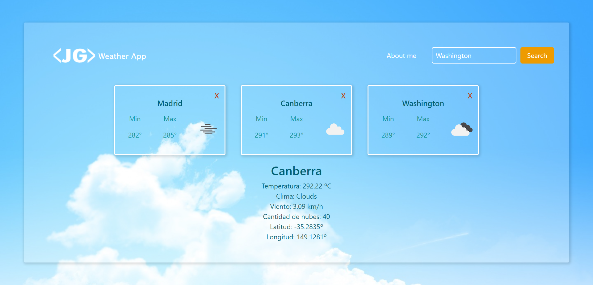

# Weather App

  

## 📝Description:

Development of an APP using React with Routing and CSS styles for the Front End and consuming data from the Open Weather API. It allows you to search for several cities and know in detail their weather conditions. This app is 100% responsive made with CSS styles.

Deploy: <a href='https://weather-app-two-flax.vercel.app/' target='_blank'>https://weather-app-two-flax.vercel.app</a>

#### Used technologies:
- [ ] Javascript
- [ ] React
- [ ] HTML
- [ ] CSS